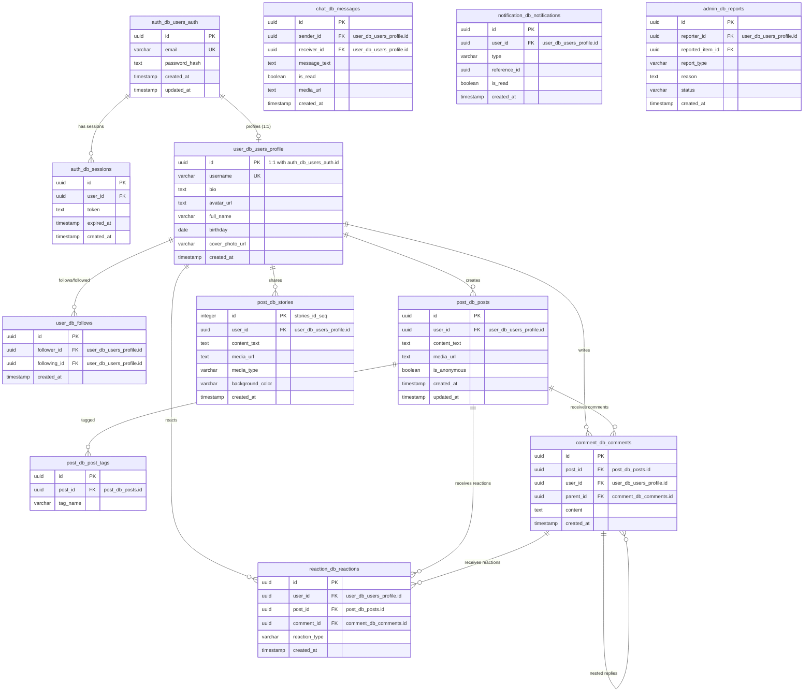

# InSight (GenZMedia) - Project Architectural & Database Summary

InSight (also known as GenZMedia) is a modern, Gen-Z-targeted social media platform. The project is designed with a **Microservices Architecture** on the backend and a **Single Page Application (SPA)** on the frontend. Both sections are fully integrated using a single PostgreSQL database partitioned into logical schemas.

---

## 1. System Architecture Overview

The system consists of three main divisions:
1. **Frontend Client**: Built with React, Vite, TailwindCSS (v4), and React Router.
2. **Backend Microservices**: Composed of 8 independent Node.js Express services, each responsible for a specific domain.
3. **Database**: A shared PostgreSQL instance (`insight_db`) organized using 8 distinct database schemas corresponding to the backend microservices.

### Microservice Directory & Port Mapping
The client interacts directly with each microservice using specific ports configured via environment variables (`.env`):

| Microservice Name | Folder Path | Port | Schema Name | Principal Responsibility |
| :--- | :--- | :--- | :--- | :--- |
| **Auth Service** | `/server/services/auth-service` | `5000` | `auth_db` | User registration, logins, session management, and JWT issuing. |
| **User Service** | `/server/services/user-service` | `50052` | `user_db` | User profiles, follower/following relationships, and user searches. |
| **Post Service** | `/server/services/post-service` | `50053` | `post_db` | Creating, updating, deleting posts and stories (text, image, video). |
| **Comment Service** | `/server/services/comment-service` | `50054` | `comment_db` | Creating, deleting, and retrieving nested comments and replies. |
| **Reaction Service** | `/server/services/reaction-service` | `50055` | `reaction_db` | Adding and removing reactions (likes/dislikes) for posts or comments. |
| **Notification Service** | `/server/services/notification-service` | `50056` | `notification_db` | Managing user notifications (e.g. followers, likes, comments). |
| **Chat Service** | `/server/services/chat-service` | `50057` | `chat_db` | Direct messaging history, unread badges, and conversation lists. |
| **Admin Service** | `/server/services/admin-service` | `50060` | `admin_db` | Moderation reporting, checking report queues, and resolving issues. |

---

## 2. Database Schema & Dump Analysis

All services share a single PostgreSQL database (`insight_db`) but use qualified schema names to partition tables.

### Entity Relationship & Schema Diagram

### Table Breakdown & Specifications

1. **`admin_db.reports`**: Tracks complaints/reports. Fields include `reporter_id`, `reported_item_id` (flexible reference to posts or comments), `report_type` (e.g. POST, COMMENT), `reason`, and a `status` defaulting to `'PENDING'`.
2. **`auth_db.users_auth`**: Essential credentials table. Stores user email (unique) and bcrypt-hashed password.
3. **`auth_db.sessions`**: Handles persistent user login sessions via JWT.
4. **`chat_db.messages`**: Stores message exchanges. Includes a `media_url` field for attachments (images/videos) and supports reading statuses.
5. **`comment_db.comments`**: Supports hierarchical replies. The `parent_id` points to a parent comment (nullable).
6. **`notification_db.notifications`**: Stores occurrences of reactions, new followers, and comments, with dynamic `reference_id` attributes.
7. **`post_db.posts`**: Core feeds table. Supports markdown text, media uploads, and a flag `is_anonymous` for incognito posts.
8. **`post_db.stories`**: Temporal status updates. Contains background colors, text, or media types ('text', 'image', 'video'). Uses a sequence generator for IDs (`stories_id_seq`).
9. **`reaction_db.reactions`**: Implements a check constraint: `reactions_check` ensures that either `post_id` is populated OR `comment_id` is populated, but never both.
10. **`user_db.follows`**: Captures following graphs. Implements a unique composite index on `(follower_id, following_id)`.
11. **`user_db.users_profile`**: Handles user identity details (bio, avatar, full name, birthday, cover photo). The username is unique.

---

## 3. Communication Patterns

### A. Frontend to Backend
The client routes API traffic using a centralized utility script located in [api.js](file:///C:/Users/faisf/Downloads/insight_db/InSight-main/client/src/utils/api.js). Rather than utilizing a gateway, it initiates Axios instances targeting the separate microservice ports directly:
- **`authApi`** -> Port `5000`
- **`userApi`** -> Port `50052`
- **`postApi`** -> Port `50053`
- **`commentApi`** -> Port `50054`
- **`reactionApi`** -> Port `50055`
- **`notificationApi`** -> Port `50056`
- **`chatApi`** -> Port `50057`
- **`adminApi`** -> Port `50060`

Each Axios request automatically appends the user's JWT from `localStorage` as a Bearer authorization token.

### B. Microservice Inter-Service Calls
While most microservice architectures avoid shared databases, this project leverages PostgreSQL's cross-schema capability to retrieve compound data directly in SQL. For example:
- **`chat-service`** executes a SQL query joining `chat_db.messages` with `user_db.users_profile` to retrieve sender avatars and names.
- **`comment-service`** joins `comment_db.comments` with `user_db.users_profile` in SQL to fetch authors during listing.

However, mutating operations trigger REST calls between services via Axios:
- **Registration**: When a user signs up, `auth-service` makes a `POST` request to `user-service` (`http://localhost:50052/user`) to establish the empty profile.
- **Deletion**: When an account is terminated, `auth-service` makes a `DELETE` request to `user-service` (`http://localhost:50052/user/:id`) to purge associated profile details.

---

## 4. Notable Implementation Details & Architectural Quirks

1. **Obsolete Root Files**: The files `server/index.js` and `server/database.sql` are legacy templates for a simple Todo/Auth application. They do not run and are not utilized in the microservice setup.
2. **Hardcoded Administrative Credentials**: In both `auth-service` and `post-service`, admin rights are managed using hardcoded checks for IDs `'admin-1'` and `'admin-2'`.
3. **TailwindCSS & Typography**: The frontend utilizes TailwindCSS (v4) and imports the Google Font `Outfit` globally.
4. **Protective Routes**: Router levels in React define a `ProtectedRoute` for authenticated users and an `AdminRoute` specifically checking if the user object contains `role: "admin"`.
